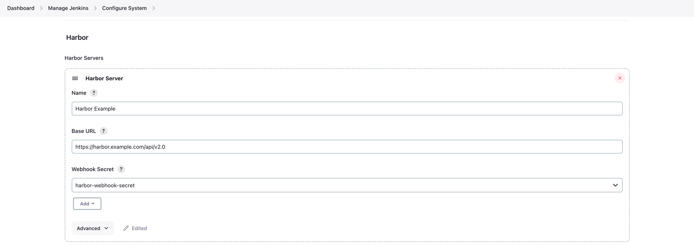

# harbor-plugin

## Introduction

The Harbor Plugin enables integration between Jenkins and Harbor services. It provides the capability to synchronize and asynchronously wait for Harbor image scan results during Jenkins pipelines. The plugin ensures pipeline execution is interrupted if any security risks are detected, while allowing the pipeline to continue if the image passes the security scan.

### Features

- Integration between Jenkins and Harbor services.
- Synchronize with Harbor for image scan results.
- Asynchronous waiting for scan results.
- Ability to interrupt pipeline execution for detected security risks.
- Seamless integration with Jenkins pipelines.

### Requirements

- Jenkins 2.x or later.
- Harbor service configured and accessible.

## Getting started

1. Install the Harbor Plugin on your Jenkins server.

2. Go to the global configuration and add Harbor Server Config.



> Webhook secret has not been implemented yet, please ignore the configuration.

3. Using Snippet Generator to Generate Code for Pipeline Testing.

```groovy
waitForHarborWebHook abortPipeline: true, credentialsId: 'harbor_credentials', server: 'Harbor Example', severity: 'Critical'
```

## Acknowledgments

We would like to express our gratitude to the following projects and communities:

- [Harbor](https://goharbor.io/): We extend our heartfelt thanks to the Harbor project for providing an excellent open-source solution for private artifact repositories. Their contribution in addressing our private artifact management needs has been invaluable.

- [SonarQube](https://github.com/jenkinsci/sonarqube-plugin): We would like to acknowledge the SonarQube community for their remarkable SonarQube plugin implementation. We have drawn inspiration from their work during the development of this plugin, and it has greatly contributed to the functionality and quality of our integration.

## Issues

TODO Decide where you're going to host your issues, the default is Jenkins JIRA, but you can also enable GitHub issues,
If you use GitHub issues there's no need for this section; else add the following line:

Report issues and enhancements in the [Jenkins issue tracker](https://issues.jenkins.io/).

## Contributing

TODO review the default [CONTRIBUTING](https://github.com/jenkinsci/.github/blob/master/CONTRIBUTING.md) file and make sure it is appropriate for your plugin, if not then add your own one adapted from the base file

Refer to our [contribution guidelines](https://github.com/jenkinsci/.github/blob/master/CONTRIBUTING.md)

## LICENSE

Licensed under MIT, see [LICENSE](LICENSE.md)

